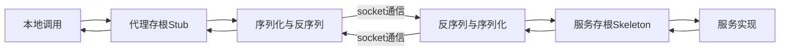
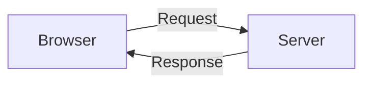

## RPC与REST的对比与分析

### 什么是RPC

>摘自wiki：
>
>在分布式计算，远程过程调用是一个计算机通信协议。该协议允许运行于一台计算机的程序调用另一个地址空间的子程序，而程序员就像调用本地程序一样，无需额外地为这个交互作用编程。RPC是一种服务器-客户端模式，经典实现是一个通过发送请求-接受回应进行信息交互的系统。

RPC（Remote Procedure Call）是为了解决分布式系统中不同（系统）服务之间的数据交互问题，它Nelson于1981年提出，旨在做到“像调用本地方法一样调用远程方法”  。

#### 核心组成

RPC核心流程如下所示

- 本地调用：正常的业务逻辑，使用和本地方法没有区别
- 本地代理存根: 拿到本地具体调用的是（远程）什么方法，什么参数

- 本地序列化反序列化：将上面拿到的数据进行序列化，当远程返回数据后再反序列化

- 网络通信：socket通信，一般是TCP

- 远程反序列化和序列化：拿到通信结果进行反序列化传到下一个流程，当下一个流程返回结果则进行序列化传到网络上

- 远程服务存根： 拿到序列化的结果后，找服务映射，然后转给具体服务处理

- 调用实际业务服务：实际的业务接口实现

#### 使用场景

强调性能传输，期望使用时像本地方法一样使用，适用于同一个系统内的不同服务之间，比如现在的微服务架构系统

### 什么是REST

>摘自wiki：
>
>表现层状态转换是Roy Thomas Fielding博士于2000年在他的博士论文中提出来的一种万维网软件架构风格，目的是便于不同软件/程序在网络中互相传递信息。表现层状态转换是根基于超文本传输协议之上而确定的一组约束和属性，是一种设计提供万维网络服务的软件构建风格。

Rest(Representational State Transfer)是一种架构风格，通过在接口上施加一组特定约束来实现对服务资源的访问控制。

#### 核心组成

Rest流程如下所示：

**资源**：网络上的具体信息，可以是一段文本，一张图片，一种服务等等，总之是具体的实体。可以被一个URI指向它，且访问这个资源，访问它的URI即可，这类URI是每个资源的识别符。

**表现层**：资源具体呈现的形式，称为表现层，比如文本可以用txt格式、html格式、XML格式等等表现。

**状态转化**：如果客户端想要操作服务器，必须通过某种手段，让服务器端发生"状态转化"。而这种转化是建立在表现层之上的，所以就是"表现层状态转化"。那么这种操作方式，用到的就是HTTP协议里定义的GET、POST、PUT和DELETE等等

总结它的特点

- 每一个URI代表一种资源；

- 客户端和服务器之间，传递这种资源的某种表现层；

- 客户端通过四个HTTP动词，对服务器端资源进行操作，实现"表现层状态转化"。

#### 使用场景

对外暴露接口服务，但需要严格控制请求类型和信息格式，适合于网站对外服务

### RPC与REST的对比

1. RPC使用的是client/server模式，REST更倾向于browser/server
2. RPC一般基于TCP协议，REST一般基于HTTP协议
3. 根据使用的协议可知，RPC效率更高，因为携带信息更少，更接近网络传输
4. 根据使用的协议可知，REST表达更具可读性
5. REST约束力更强，RPC没有统一标准
6. RPC的灵活和更接近底层，所以它可以实现REST

### 参考

[Debunking the Myths of RPC & REST](https://etherealbits.com/2012/12/debunking-the-myths-of-rpc-rest/)

[远程过程调用](https://zh.wikipedia.org/zh-cn/%E9%81%A0%E7%A8%8B%E9%81%8E%E7%A8%8B%E8%AA%BF%E7%94%A8)

[任务队列和消息队列，rpc的区别](https://www.zhihu.com/question/265988880/answer/747819369)

[理解RESTful架构](https://www.ruanyifeng.com/blog/2011/09/restful.html)

[Remote Procedure Call (RPC)](https://searchapparchitecture.techtarget.com/definition/Remote-Procedure-Call-RPC)

[http与rpc的区别与联系](https://www.zhihu.com/question/41609070/answer/1030913797)
